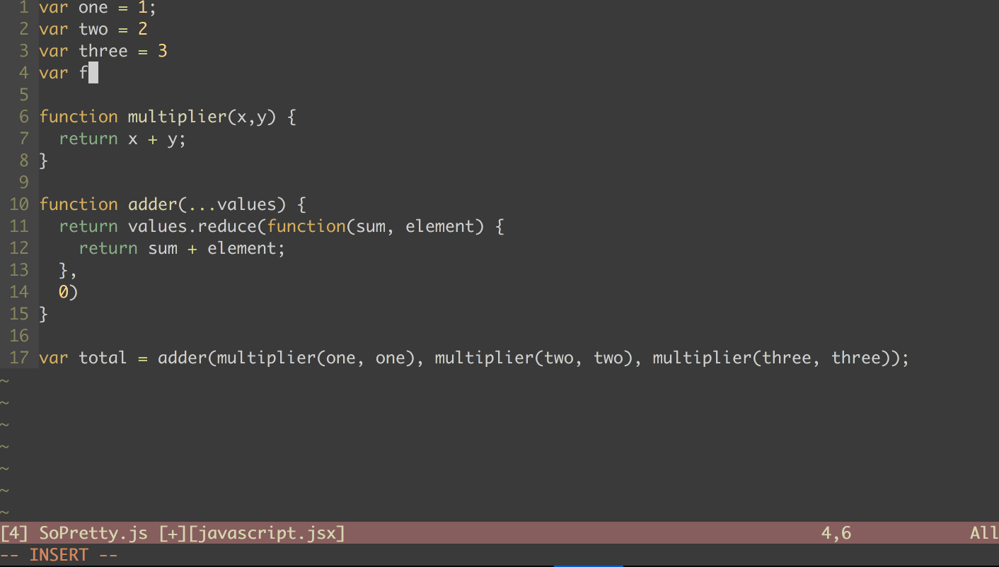
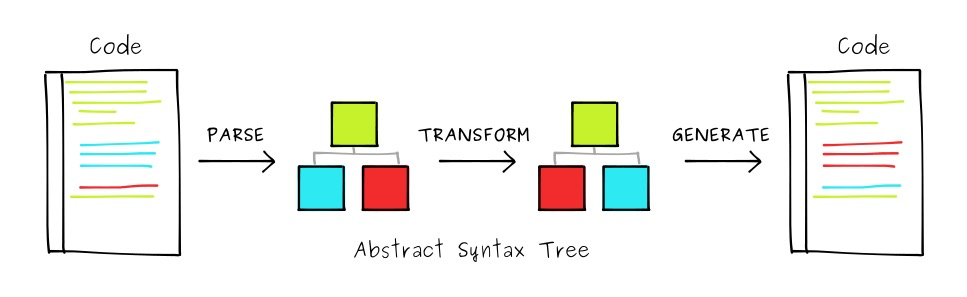

Spaces or tabs? Semicolons or not? If you're a developer, you probably know what I'm talking about. If you are not, be aware that these questions are at the heart of heated debates within each development team.

These debates may seem absurd but they are very important. Respecting a coding-style makes it easier for everyone to work and move forward in the same direction. Only we all agree that it is not very productive and that it is a waste of time.

You must know that the developer is someone very rigorous. Once the debate is over and everyone agrees, it will follow the rule imposed at all costs. We all found ourselves modifying a piece of code by hand to redo the indentation for 10 minutes like a compulsive maniac. We feel a little silly at the moment but in the end we feel better but also a little guilty of having sacrificed 10 minutes ...

## Code formatters

Many languages have solved these problems, they provide a code formatter with the language. We have, for example, [`gofmt`](https://golang.org/cmd/gofmt/) for Go and [`rustfmt`](https://github.com/rust-lang-nursery/rustfmt) for Rust.

It's quite simple, you run a command on your file (often on backup) and your code is magically formatted according to already established rules. Goodbye debates, goodbye time spent re-indenting the 10 lines of the colleague, we save the file and we are happy.

When you use a code formatter for the first time, you tend to be a little frustrated. Then after a while we trust it and we are really happy that he does the boring work for us!

## Prettier

Until now, JavaScript did not have an effective formatter. This is where Prettier made its appearance. Initiated by [James Long](https://github.com/jlongster) the project was spotted and propelled by [Christopher Chedeau](https://github.com/vjeux), a developer working at Facebook, behind the success of React.

**Prettier** became the formatter for JavaScript. With the support of **JSX, CSS, GraphQL** and even [**styled-components**](https://www.styled-components.com/), the project quickly gained popularity especially among front-end developers.

With [Prettier](https://prettier.io/), the experience is incredible, in addition to sweeping all the debates it allows to focus on the code without worrying about the rest. This is without a doubt **the tool that has saved me the most time in the last 5 years**. I estimate at around **1 hour per day the time saved thanks to Prettier**.

## How to use it?

What made Prettier so successful is its ease of use.

[There are plugins for all your favorite editors](https://prettier.io/docs/en/editors.html), Atom, Visual Studio Code, Sublime Text ...

Once the plugin is installed, you can adjust some parameters:

- Line length
- Tabulations or spaces
- Semicolons or not
- Single or double quote
- End of line commas

And that's where the magic happens, every time you save a file the code is automatically formatted! Isn't life beautiful?



## Prettier 1.6

Since the last release of Prettier released today, it is possible to specify a configuration file per project.

Just add a `.prettierrc` to the root of the project and define your rules:

```js
// .prettierrc
{
  "trailingComma": "es5",
  "singleQuote": true
}
```

There are [many available options](https://prettier.io/docs/en/options.html).

You can also choose which files to ignore with a `.prettierignore`:

```
# .prettierignore
dist/
package.json
```

This will help you avoid accidents and on-board your developers even faster!

## How does prettier work?

With the arrival of ES6 and Babel, JavaScript has been very much geared around code parsing. It is thanks to these advances we can now format code with Prettier.

Using [babel-parser](https://github.com/babel/babel/tree/master/packages/babel-parser), the Babel AST generator, Prettier generates an AST and rebuilds a code based on the rules you have chosen. An AST or Abstract Syntax Tree is a tree representation of a code, to understand what it is you can take a look at [AST Explorer](https://astexplorer.net/).



This is how Prettier owes its speed and reliability. Of course Prettier is open-source and the most curious among you can read [the code](https://github.com/prettier/prettier).

But if you want to contribute, do not forget to install Prettier, because yes the Prettier code is formatted with Prettier!
