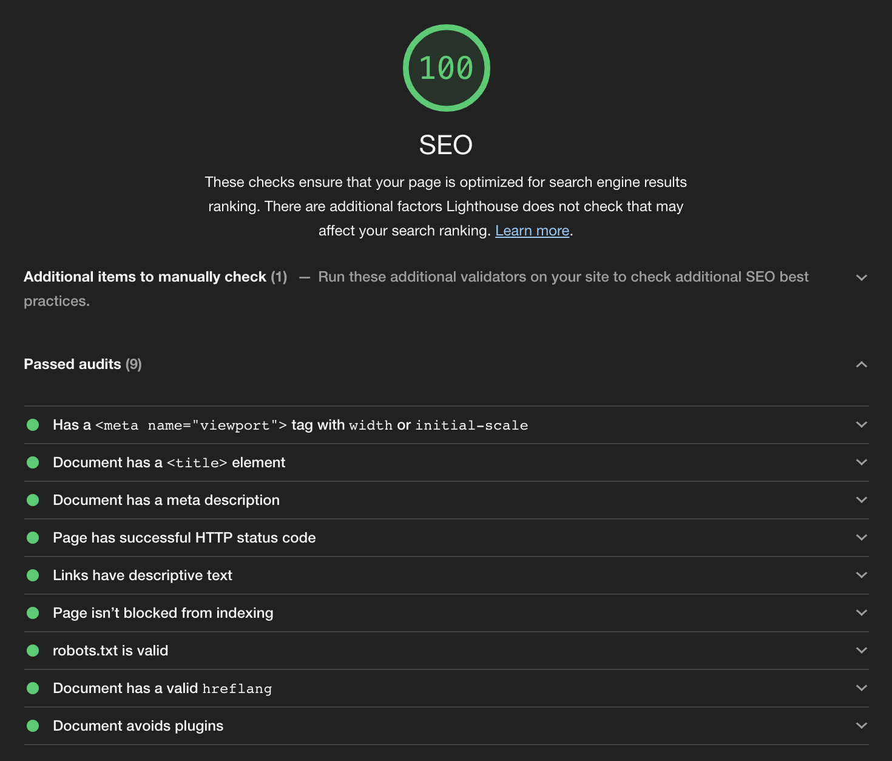
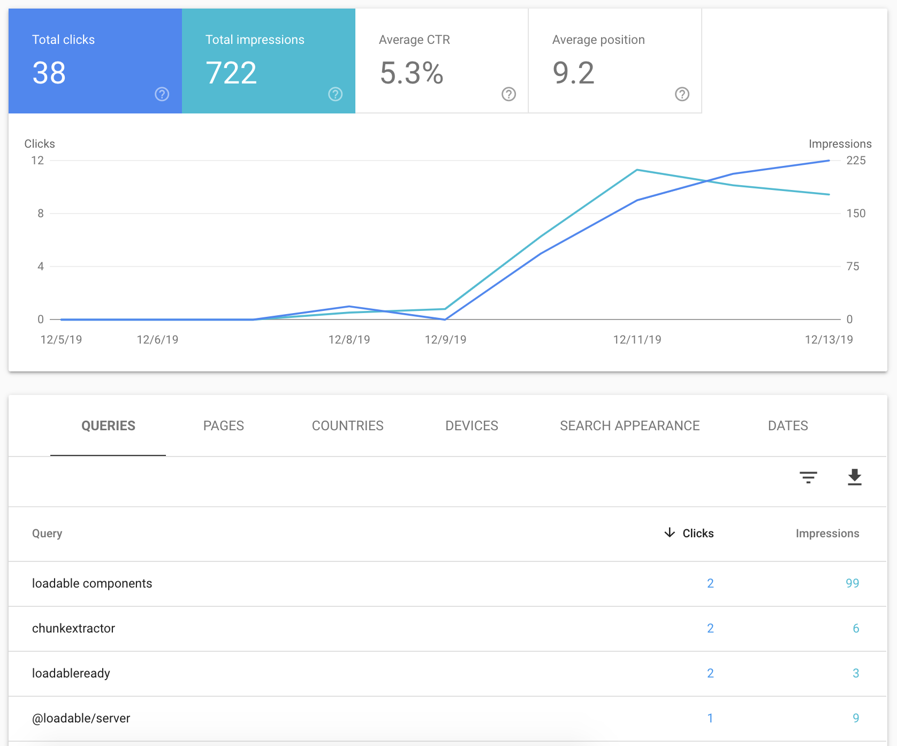

[Gatsby](https://www.gatsbyjs.com/) est un outil génial pour créer un site personnel ou un site vitrine. Être présent sur la première page de Google est un enjeux crucial dans la plupart des business. C'est l'art du <abbr title="Search Engine Optimization">SEO</abbr> qui entre en jeu, une science inexacte mais dont on connaît tout de même quelques secrets.

## Contenu

La chose la plus importante pour être bien référencé c'est sans conteste le contenu. Votre site doit avoir un **contenu riche et original**. Inutile de vous dire que copier des paragraphes de [Wikipedia](https://www.wikipedia.org/) sera considéré comme du "duplicate content" et cela ne plaira pas à Google.

Prenez le temps d'écrire un contenu riche en utilisant tout ce que nous offre le <abbr title="Hypertext Markup Language">HTML</abbr> pour le mettre en valeur :

- Titres : un seul [`h1`](https://developer.mozilla.org/en-US/docs/Web/HTML/Element/Heading_Elements) puis des [`h2`](https://developer.mozilla.org/en-US/docs/Web/HTML/Element/Heading_Elements), [`h3`](https://developer.mozilla.org/en-US/docs/Web/HTML/Element/Heading_Elements), etc...
- Mises en avant : [`strong`](https://developer.mozilla.org/en-US/docs/Web/HTML/Element/strong) et [`em`](https://developer.mozilla.org/en-US/docs/Web/HTML/Element/em)
- Balises spécifiques : [`abbr`](https://developer.mozilla.org/en-US/docs/Web/HTML/Element/abbr), [`cite`](https://developer.mozilla.org/en-US/docs/Web/HTML/Element/cite) et [`blockquote`](https://developer.mozilla.org/en-US/docs/Web/HTML/Element/blockquote)

Le HTML est très riche, profitez-en ! Cela rendra votre site plus <strong>accessible</strong> et cela plaira aussi à Google.

Un <strong>contenu frais et récent</strong>, c'est également important. Pour cela Gatsby est parfait. Vous pouvez facilement écrire des articles en Markdown comme je suis en train de le faire ici. Un blog joue un rôle clef dans le référencement de votre site.

## Meta tags

Les robots comprennent le contenu de votre site, mais ils aiment également être aidés et pour cela ils ont un langage bien à eux : les meta tags. Ce sont des balises à ajouter dans le `<head>` destinées aux robots.

Les meta tags importantes pour le référencement sont :

- L'attribut [`<html lang>`](https://developer.mozilla.org/en-US/docs/Web/HTML/Global_attributes/lang) : c'est la langue de votre site
- Le [`<title>`](https://developer.mozilla.org/en-US/docs/Web/HTML/Element/title) : c'est le titre de votre page, visible également dans l'onglet du navigateur
- Le [`<meta name=description>`](https://developer.mozilla.org/en-US/docs/Learn/HTML/Introduction_to_HTML/The_head_metadata_in_HTML) : c'est la description de votre site, elle sera affichée dans les listes de résultats
- Le [`<meta name="viewport">`](https://developer.mozilla.org/en-US/docs/Mozilla/Mobile/Viewport_meta_tag) : celui-ci décrit le comportement de votre site en mobile, on y reviendra mais le responsive joue aussi un rôle clef dans le référencement

Pour ajouter ces meta tags, le meilleur moyen c'est d'utiliser [react-helmet](https://github.com/nfl/react-helmet). Il permet de téléporter des composants dans le `<head>`, notamment tous les Meta Tags.

Pour installer react-helmet avec Gatsby, il est recommandé d'utiliser [gatsby-plugin-react-helmet](https://www.gatsbyjs.org/packages/gatsby-plugin-react-helmet/). Ce plugin permet de faire en sorte que React Helmet ajoute les tags au HTML static généré par Gatsby.

Vous devez installer gatsby-plugin-react-helmet et react-helmet :

```
npm install gatsby-plugin-react-helmet react-helmet
```

Puis ajouter le plugin dans `gatsby-config.js` :

```js
plugins: [`gatsby-plugin-react-helmet`]
```

Une fois que c'est fait, vous pouvez utiliser react-helmet dans vos pages :

```js
import React from 'react'
import { Helmet } from 'react-helmet'

export default function HomePage() {
  return (
    <main>
      <Helmet>
        <html lang="en" />
        <title>My homepage</title>
        <description>Description of your homepage.</description>
      </Helmet>
      <h1>Home of my website</h1>
    </main>
  )
}
```

Vous noterez que `<meta name="viewport">` est absent, c'est parce que Gatsby l'ajoute automatiquement pour vous.

Les meta tags sont incontournables pour être bien référencé. Il est également possible d'aller plus loin avec les données structurées.

### Données structurées

Les [données structurées](https://developers.google.com/search/docs/guides/intro-structured-data) complètent les meta tags, elles permettent de <strong>décrire précisément</strong> ce que vous proposez sur votre site. Vous pouvez par exemple décrire une recette de cuisine, un article, un produit, des avis, des livres, des cours ou plus simplement un breadcrumbs, un carousel ou une FAQ.

Ces données structurées permettent à Google de <strong>générer des [widgets](https://developers.google.com/search/docs/guides/search-gallery)</strong> directement disponibles dans les résultats de recherche. Ces widgets sont toujours <strong>affichés en haut de la page</strong>, ce qui place votre site en top position !

Pour ajouter des données structurées avec Gatsby, c'est encore une fois Helmet qui va s'y coller. Commencez par créer un composant générique permettant d'ajouter du [JSON-LD](https://json-ld.org/), le format dans lequel sont décrites les données structurées.

```js
import React from 'react'
import Helmet from 'react-helmet'

export function JsonLd({ children }) {
  return (
    <Helmet>
      <script type="application/ld+json">{JSON.stringify(children)}</script>
    </Helmet>
  )
}
```

Une fois ce composant créé, il vous suffit d'ajouter les données structurées dans vos pages :

```js
import React from 'react'
import { Helmet } from 'react-helmet'
import { JsonLd } from '../components/JsonLd'

export default function HomePage() {
  return (
    <main>
      <Helmet>
        <title>My homepage</title>
        <description>Description of your homepage.</description>
        <JsonLd>
          {{
            '@context': 'https://schema.org',
            '@type': 'Organization',
            url: 'http://www.example.com',
            name: 'My website',
            contactPoint: {
              '@type': 'ContactPoint',
              telephone: '+1-401-555-1212',
              contactType: 'Customer service',
            },
          }}
        </JsonLd>
      </Helmet>
      <h1>Home of my website</h1>
    </main>
  )
}
```

Une fois que vous avez terminé, n'oubliez pas de tester les données structurées avec [le testeur de données structurées fourni par Google](https://search.google.com/structured-data/testing-tool).

## Linking

<strong>
  Chacune des pages de votre site internet doit être accessible en trois clics
  maximum depuis la page d'accueil.
</strong> Grâce à cela, les robots peuvent naviguer et découvrir les pages très rapidement.

Les pages récentes doivent être accessibles en un ou deux clics. Les nouveaux contenus sont ceux qui doivent être indexés en priorité et pour cela, les robots doivent pouvoir les trouver très rapidement.

Il n'y a pas de plugin magique pour appliquer ces conseils. Pour un petit site, il s'agit simplement de bon sens, créer une navigation bien pensée et cela suffira. En revanche pour un gros site, il faudra que vous mettiez en place une stratégie de pagination plus élaborée, comme celle utilisée sur [synonymes.xyz](https://www.synonymes.xyz/dictionnaire-de-synonymes/A) par exemple.

## Sitemap

Le linking de votre site est important, mais cela ne veut pas dire qu'on ne peut pas donner un coup de pouce aux robots pour découvrir les liens. Pour cela il existe les sitemaps, des fichiers <abbr title="Extensible Markup Language">XML</abbr> lus par les robots qui permettent de lister des liens.

Avec Gatsby, les sitemaps c'est plutôt simple, toutes les pages sont générées et donc connues. Le plugin [gatsby-plugin-sitemap](https://www.gatsbyjs.org/packages/gatsby-plugin-sitemap/) permet de <strong>générer un sitemap automatiquement avec Gatsby</strong>.

L'ajout de ce plugin dans `gatsby-config.js` générera un sitemap automatiquement :

```js
// In your gatsby-config.js
siteMetadata: {
  siteUrl: `https://www.example.com`,
},
plugins: [`gatsby-plugin-sitemap`]
```

Attention à bien renseigner le `siteUrl` pour que les URLs de votre sitemap soient correctes.

## Duplicate content

Souvent avec Gatsby vous vous retrouvez à déployer plusieurs versions de votre site. C'est notamment le cas si vous utilisez [Netlify](http://netlify.com/). Des previews peuvent être déployées automatiquement sur chaque pull-request.

Si Google est amené à référencer l'une de ces previews avant votre site, il peut considérer que votre site principal fait du "duplicate content" et ce n'est jamais bon pour le référencement. En plus de cela, des utilisateurs pourraient tomber sur une preview non disponible. Bref on ne veut pas de ces previews dans le moteur de recherche.

La solution pour ça c'est de le dire dans un fichier `robots.txt`. Là encore un plugin Gatsby peut nous aider : [gatsby-plugin-robots-txt](https://www.gatsbyjs.org/packages/gatsby-plugin-robots-txt/).

Voici la configuration à appliquer si vous utilisez Netlify :

```js
const {
  NODE_ENV,
  URL: NETLIFY_SITE_URL = 'https://www.example.com',
  DEPLOY_PRIME_URL: NETLIFY_DEPLOY_URL = NETLIFY_SITE_URL,
  CONTEXT: NETLIFY_ENV = NODE_ENV,
} = process.env
const isNetlifyProduction = NETLIFY_ENV === 'production'
const siteUrl = isNetlifyProduction ? NETLIFY_SITE_URL : NETLIFY_DEPLOY_URL

module.exports = {
  siteMetadata: {
    siteUrl,
  },
  plugins: [
    {
      resolve: 'gatsby-plugin-robots-txt',
      options: {
        resolveEnv: () => NETLIFY_ENV,
        env: {
          production: {
            policy: [{ userAgent: '*' }],
          },
          'branch-deploy': {
            policy: [{ userAgent: '*', disallow: ['/'] }],
            sitemap: null,
            host: null,
          },
          'deploy-preview': {
            policy: [{ userAgent: '*', disallow: ['/'] }],
            sitemap: null,
            host: null,
          },
        },
      },
    },
  ],
}
```

Si vous utilisez un autre hébergeur, il vous suffit d'adapter la configuration précédente selon le même principe.

## Performance

Plus votre site est performant, mieux il sera référencé, et ce pour deux raisons. Google aloue un temps de crawling à votre site, plus vos pages se chargent rapidement plus il aura le temps d'en indexer. L'autre raison c'est que Google commence à favoriser les sites performants dans ses résultats, on ne connait pas précisément ses critères mais on sait que ça pèse dans la balance.

Avec Gatsby la performance est souvent assurée, mais méfiez-vous tout de même. Faites attention à ne pas charger des librairies JavaScript trop grosses ou inutiles.

## Accessibilité

Votre site se doit d'être accessible, à la fois sur mobile et sur desktop. On parle ici d'accessibilité au sens large. Il doit être utilisable par tous, faites donc attention à tous ces détails :

- Le contraste des textes
- La taille des polices
- La taille des liens
- Le texte des liens et des boutons
- Les textes alternatifs sur les images

C'est tout ces petits critères mis bout à bout qui permettront à votre site de se démarquer et d'être mieux référencé par Google.

## Analyser son SEO

### Lighthouse

Pour savoir si vous remplissez tous les critères, l'audit Lighthouse est le meilleur outil. Directement accessible dans les devtool de Chrome, vous pouvez lancer un audit sur n'importe quel site.



### Google Search Console

Google propose une [Search Console](https://search.google.com/search-console/about) très complète qui vous permettra d'analyser le SEO de votre site.



Vous pourrez notamment savoir combien de pages sont indexées, les widgets et bien-sûr les performances et les liens cliqués depuis le moteur de recherche Google.

Il est important d'ajouter votre site dans cette console, si vous disposez d'un sitemap vous pouvez également en faire part à Google.

## Conclusion

Pour avoir un SEO au top avec Gatsby, il y a quelques incontournables faciles à mettre en place :

- Ajouter des meta tags avec [gatsby-plugin-react-helmet](https://www.gatsbyjs.org/packages/gatsby-plugin-react-helmet/)
- Ajouter un fichier `robots.txt` avec [gatsby-plugin-robots-txt](<[gatsby-plugin-react-helmet](https://www.gatsbyjs.org/packages/gatsby-plugin-robots-txt/)>)
- Générer un sitemap avec [gatsby-plugin-sitemap](<[gatsby-plugin-react-helmet](https://www.gatsbyjs.org/packages/gatsby-plugin-sitemap/)>)

Et pour le reste, cela demande un peu plus de travail :

- Avoir un contenu riche
- Ajouter des données structurées
- Penser à l'accessibilité
- Maintenir des bonnes performances

En respectant tout cela, vous devriez rendre heureux tous vos utilisateurs qu'ils soient humains ou robots 🤖.
