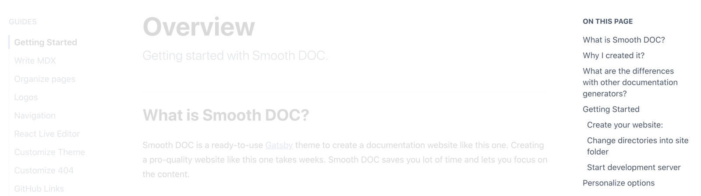
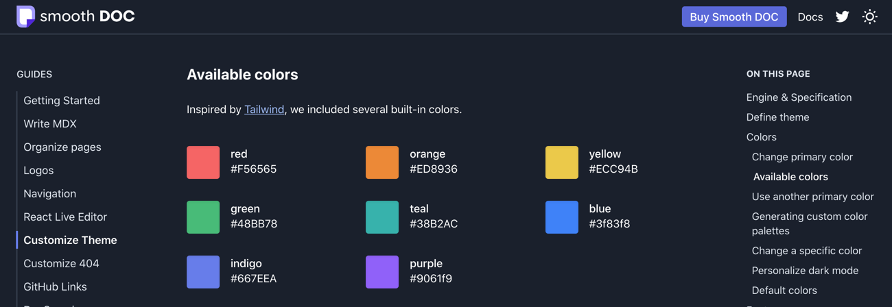
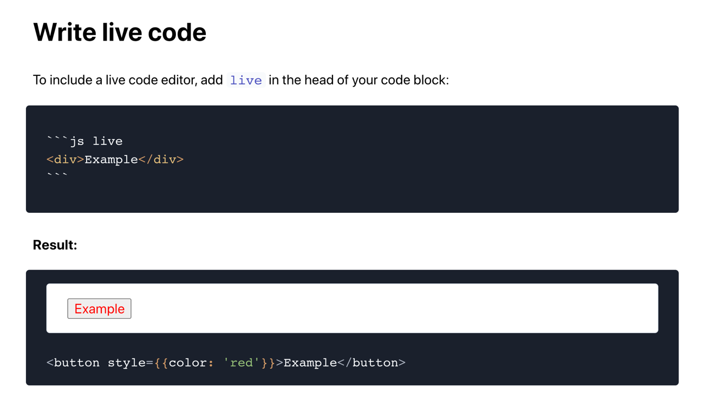
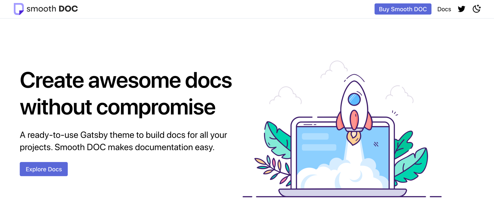

Je suis très heureux d'annoncer la sortie de [Smooth DOC](http://smooth-doc.com/) ! Cela fait maintenant plusieurs semaines que je travaille sur cette nouvelle version et elle est enfin prête 🥳.

## Comment est né Smooth DOC ?

L'open source est au coeur de ma philosophie et d'ailleurs il l'a toujours été. J'ai commencé à programmer à l'âge de 12 ans. Une fois mon premier script terminé je me suis empressé de le poster sur [Codes-Sources](https://codes-sources.commentcamarche.net/). Les vieux français comme moi s'en souviennent peut-être, c'était en quelque sorte l'ancêtre de GitHub.

Depuis cet époque je n'ai cessé de créer des projets et de les partager avec la communauté. D'abord des petites librairies, des utilitaires, puis de gros succès comme [Shipit](https://github.com/shipitjs/shipit) (un outil de déploiement en JavaScript). Au fil des années j'ai appris à écrire du code plus propre, à exposer des API plus intuitives, mais également à documenter et marketer mes projets.

Mes plus gros projets à ce jour sont [SVGR](https://react-svgr.com/) et [Loadable Components](https://loadable-components.com/). Vous vous demandez sûrement pourquoi je vous parle de ces projets alors qu'on est censé parler d'un thème Gatsby. Et bien ces projets sont le point de départ de Smooth DOC.

Grâce à mon expérience dans l'open source, j'ai compris qu'avoir un site web et une documentation est crucial dans la réussite d'un projet. Qu'il soit open source ou pas d'ailleurs. Prenons deux exemples : [Tailwind](http://tailwindcss.com/) et [Stripe](https://stripe.com/). L'un est un framework CSS open source, l'autre une solution de paiement incontournable. Tous deux sont des produits tech à succès et tous deux ont un point commun : une documentation incroyable !

> La réussite de votre projet passe par la création d'une documentation parfaite. Et c'est exactement ce pour quoi j'ai créé Smooth DOC.

Smooth DOC était d'abord une simple librairie, une sorte d'usine à documentation maison. Puis au fil du temps, je l'ai rendu plus robuste, j'ai ajouté des fonctionnalités.

Avec l'avènement de [Gatsby](https://gatsbyjs.com/), j'ai pu en faire quelque chose de vraiment portable et réutilisable. Après deux ans de développement, Smooth DOC est aujourd'hui prêt à être partagé avec la communauté !

## Qu'est-ce qu'un thème Gatsby ?


[Gatsby](https://gatsbyjs.com/) est un framework de création de sites statiques très performant. On parle ici de [JamStack](https://jamstack.org/), une stack qui a émergé il y a quelques années. L'idée est simple, on part d'une source quelle qu'elle soit (des fichiers, un CMS ou une base de données) et on génère un site complet qui peut être servi de manière statique et caché sur des CDN.

Un thème Gatsby c'est en quelque sorte un Gatsby pré-configuré. Tous les plugins sont au bon endroit, tous les composants sont prêts, la génération des pages, le CSS, le sitemap, bref vous n'avez plus qu'à mettre les pieds sous la table.

## Comment fonctionne Smooth DOC ?


Smooth DOC utilise comme source des fichiers [MDX](https://mdxjs.com/). Vous connaissez le Markdown ? Vous connaissez React ? Et bien le MDX c'est un mix des deux. En gros cela vous permet d'utiliser des composants React à l'intérieur d'un fichier Markdown. On allie la fluidité d'écriture du Markdown avec la flexibilité offerte par React.

Donc si on résume, Smooth DOC est un projet qui vous permet d'obtenir une documentation de qualité professionnelle en écrivant des fichiers Markdown.

**Exemple de fichier de documentation Smooth DOC:**

```
---
title: Getting Started
---

# Getting Started

How to get ready in five minutes...

```

Plutôt intuitif n’est-ce pas ?

## Fonctionnalités

Je vous fais un tour rapide des fonctionnalités proposées par Smooth DOC.

### Table des matières



Sur la droite de la documentation, une table des matières est automatiquement générée en fonction des titres de votre documentation. Cela permet à l'utilisateur de connaître en un coup d'oeil les sujets abordés sur la page.

### Mode nuit



Le mode nuit est supporté par défaut. Il arrive que l'on passe beaucoup de temps sur une documentation. En tant que développeur, je sais que quand je lis une documentation, le mode nuit est quelque chose d'incontournable.

### React Live Code Editor



Un éditeur de code live, vos utilisateurs peuvent interagir directement sur la documentation sans même avoir besoin d'ouvrir un éditeur de code !

### Composants prêts à l'usage



Smooth DOC ne s'arrête pas à la documentation, il fournit aussi de nombreux composants pour vous permettre de créer une page d'accueil attrayante.

### Et bien d'autres...

De nombreuses autres fonctionnalités sont disponibles dans Smooth DOC :

- Le support du SEO et du sitemap
- Les images de partages sur Twitter, LinkedIn
- Les liens d'édition dans GitHub
- L'ajout de Carbon Ads pour monétiser votre projet
- Les redirections
- La personnalisation du menu
- Algolia DocSearch
- ...

## Comment installer Smooth DOC ?

Pour vous permettre d'installer Smooth DOC, il vous faudrait sûrement une bonne documentation. Comme ça tombe bien ! Je vous renvoie donc vers le site de [Smooth DOC](http://smooth-doc.com/) (réalisé avec Smooth DOC bien sûr 🤗). Vous y trouverez toutes les informations nécessaires !
