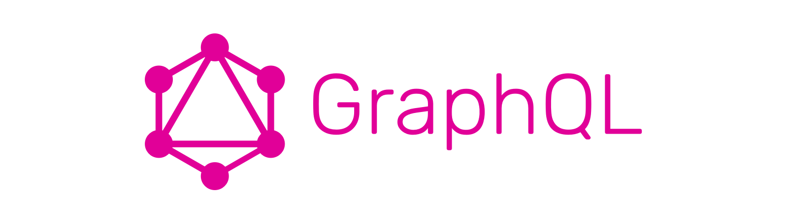
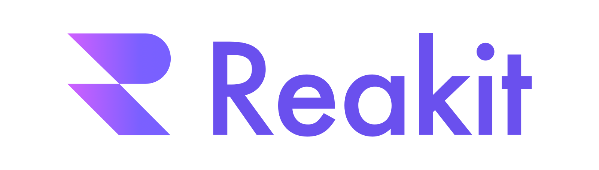
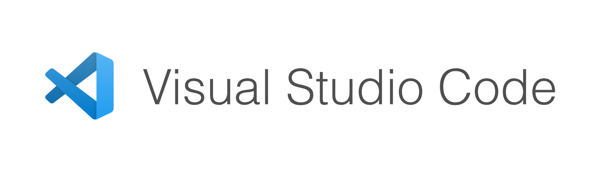

It has now been 10 years that I use JavaScript on a daily basis both on the client and server side. Over the years, I have created many projects that have allowed me to experiment and refine my favorite technical stack. As we kick start 2020, I feel like it's time to share it with you!

## Backend

### Database

#### PostgreSQL

[PostgreSQL](https://www.postgresql.org/) is a strong, performant and resilient database. It is a relational database with its advantages: structure and constraints. It is as flexible as a NoSQL database with the JSONb type. Note that PostgreSQL also allows you to do Full Text research. It will save you from installing an Elastic Search for simple cases. It is for me the reference database and I use it in all my projects.

#### Redis

[Redis](https://redis.io/) is a very fast key/value database, it uses RAM and does not write on hard disk. I use it to store volatile data: sessions, cache. Redis also allows pub / sub and lock, which is useful on distributed projects.

### Data

#### Knex.js

[Knex.js](http://knexjs.org/) is a SQL builder, it allows you to write queries with object syntax. This may seem superfluous but it is quite useful to be able to compose your requests according to parameters, in APIs in particular. Knex.js works perfectly with Postgres, even special fields like JSONb are supported. Transactions are also supported natively. Its migration and seed system is a precious ally and allows for simplified teamwork.

#### Objection.js

[Objection.js](https://vincit.github.io/objection.js/) is an ORM, it works with [Knex.js](http://knexjs.org/) but adds a model layer to it. The models are validated via JSON Schema, which allows a very precise description of the expected data. Objection.js allows you to materialize the relationships between your models and add a business layer closest to your database. It is a safe and reliable ORM thanks in particular to the fact that it is based on Knex.js.

### HTTP server

#### Express

[Express](https://expressjs.com/) is the reference web micro-framework for Node.js. It allows you to structure your HTTP server intuitively. I use Express to organize my HTTP application, compartmentalize it, manage CORS, redirections, etc ... It is a bit the conductor of my application on the server side. Note that I prefer an Express server rather than micro-services, this allows to start a project more quickly and simply.

### Authentication

#### passport

[Passport](http://www.passportjs.org/) is an express middleware for managing authentication. Its particularity is to support many services: GitHub, Google, Facebook. It also supports local authentication, via cookie, a classic. It is a precious ally to save time, especially if you have to support several third-party services.

### Configuration

#### node-convict

Created by Mozilla, [node-convict](https://github.com/mozilla/node-convict) allows you to define a structured configuration. This allows you to see clearly what is part of your configuration. The values can be read from a file and overloaded via environment variables. It's a small library, but it allows for a clean and clear configuration.

### API

#### GraphQL

[GraphQL](https://graphql.org/) is a language for expressing APIs in graph form. The advantage of GraphQL is its simplicity and scalability. Like REST where endpoints are multiplying, GraphQL allows you to consolidate a schema. When you do an optimization, it benefits the entire application. At the documentation level, introspection makes it possible to know exactly what is available. I generally expose my schema with [Apollo Server](https://www.apollographql.com/docs/apollo-server/). GraphQL is really in the core of my stack, it ensures the communication between the client and the server.

## Front-end

### Frameworks

#### Next.js

[Next.js](https://nextjs.org/) is a React framework that allows you to create SSR or static applications. I use Next.js to save time. It hides a big complexity linked to the SSR, that allows to be concentrated on the development without being distracted. Next.js optimizes your application in an incredible way, especially with automatic static optimization. Next.js is a relatively thin layer, easy enough to migrate to another thing later.

#### Gatsby

[Gatsby](https://www.gatsbyjs.com/) is a React framework that allows you to create static applications. Gatsby is more limited than Next, I only use it for completely static sites like this blog or a showcase site. If your site is dynamic, I recommend Next instead. Gatsby is quite rigid, very efficient for static, but difficult to scale on something else, you guessed, my favorite is Next.js!

### UI / UX

#### xstyled

[xstyled](https://xstyled.dev/) is a library which allows you to style an application in a consistent manner. As the creator of xstyled, I will try to be objective. After Prettier, this is the tool that saves time the most. I use it with [styled-components](https://www.styled-components.com/) and it is a joy. The grids of xstyled and its responsive utilities allow you to create beautiful interfaces in record time! Not to mention the dark mode which can be added in just a few minutes ...!

#### Reakit

[Reakit](https://reakit.io/) is a UI library for React. The special thing about Reakit is that the components do not come with style. Reakit is in a way the skeleton of your components, it ensures you have a fully accessible application. It manages all the complex low level for components such as tabs or dialogs.

#### Smooth UI

[Smooth UI](https://smooth-ui.smooth-code.com/) is a UI library for React. It brings together both [xstyled](https://xstyled.dev/) and [Reakit](https://reakit.io/) to give ready-to-use components. It saves me precious time on projects where design is not imposed. It's kind of my Bootstrap!

## Tools

### Visual Studio Code

[VSCode](https://code.visualstudio.com/) is a code editor, optimized for JavaScript. VSCode is of course essential! Its TypeScript support allows you to obtain auto-completion even in a JavaScript project, it's nice. It supports all the functionalities that one expects from an editor: multi-cursors, shortcuts, plugins ... It is the reference editor for coding in JavaScript.

### Prettier

[Prettier](https://prettier.io/) is a JavaScript code formatter. So how do you live without Prettier? With it, you no longer worry about how to write your code. It saves me precious time every day, it's really a revolution for me and I never part with it!

### ESLint

[ESLint](https://eslint.org/) is a JavaScript code linter. It's the first thing I install on a new project. A good linter will save you precious time! It makes it possible to detect the most common errors and to guarantee a quality of code. I use [eslint-config-smooth](https://github.com/smooth-code/eslint-config-smooth) configuration.

## Hosting

### Netlify

[Netlify](http://netlify.com/) is a static site host. I use it for its simplicity and performance. It allows to link a domain easily and services such as "forms" are appreciable for a showcase site.

### Heroku

[Heroku](https://www.heroku.com/) is a modern host for Node.js and Ruby which abstracts the devops part. It is Heroku that I turn to when my project needs a database. Again, the simplicity and abstraction it offers are definite assets when launching a project. It's a pleasure to be able to add PostgresSQL in one click and to have an automatic deployment with each commit!

## Conclusion

All these tools are keys to be more effective and to create projects quickly! With time, I was able to test a lot of solutions, these are the ones that live up to my expectations.

I wish you all a very happy new year! 🎆🎊
